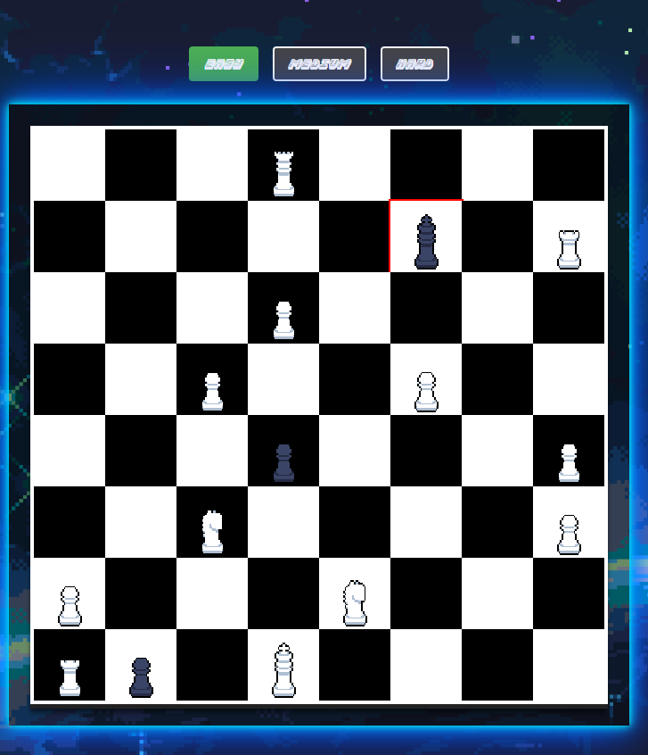

## Chess Wars

### Description

---

This is a browser-based chess game with a retro, pixel-themed interface. It supports player-versus-AI mode and includes win/loss logic to determine the outcome of the game.  
---

### Screenshot



---

### Getting Started

1. **Play the Game**: [https://chesswars.netlify.app/]  

2. **Instructions**:
   - The game starts with Player 1 (White) making the first move.
   - Select a piece to see its valid moves.
   - Move pieces using standard chess rules.
   - Checkmate the opponent's king to win the game.
   - The game displays win/loss messages when the match concludes.

3. **How to Run Locally**:
   - Clone the repository:
     ```bash
     git clone <https://github.com/JadAoun1/Chess-Game>
     ```
   - Open `index.html` in a browser to start the game or download the Live Server extension and select "Go Live".

---

### Technologies Used
- HTML
- CSS
- JavaScript 
- Custom Fonts and Images

---

### Next Steps
Future enhancements for the game include:
- **Player vs Online Player**: Add an online matchup to play against.
- **Game Timer**: Implement a timer for turn-based play.
- **Save Game Progress**: Add functionality to save and load game states.
- **Visual Effects**: Include animations for moves and captures.
- **Rule Enhancement**: Enhanced piece rules (allow castling, more efficient win/loss detection.)


---

### Attributions
- **Font**: Custom-designed fonts by Pixel Overload on itch.io.
- **Chess Piece Images**: Custom-designed images by KingWombat on itch.io.  

---
